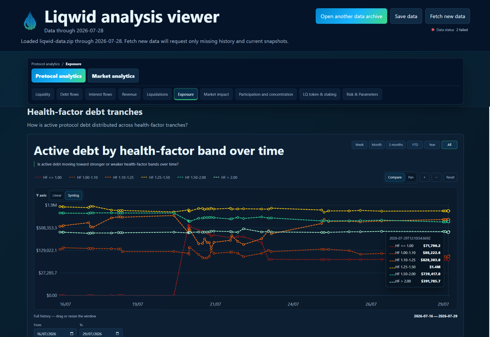

# Liqwid Finance Analytics App

An open-source, client-side web application and data pipeline for monitoring and analyzing Cardano's [Liqwid Finance](https://liqwid.finance) lending & borrowing DeFi protocol: liquidity, market dynamics, revenue, debt and interest flows, debt history and more, from the official Liqwid v2 API.



## Features

- **Protocol & Market Dynamics Analytics**: Explore TVL, utilization rate, borrow/supply APYs, active debt, debt and interest accrual vs repayment flows, risk metrics across all active markets, POL backed DAO loan positions, markets participants concentration, and more.
- **Client-Side & Offline Ready**: Runs directly in any web browser without needing a backend server or persistent daemon.
- **Portable Data Store & Zip Archive**: Bundles raw historical fetches, cleaned daily histories, and computed market datasets in a portable ZIP archive (`liqwid-data.zip`) and CSV manifest (`liqwid-portable-manifest.csv`).
- **On-Demand Data Ingestion**: Does **not** perform always-on or continuous background data ingestion. New protocol observations are queried on-demand from the official Liqwid v2 GraphQL API only when triggered by the user clicking **"Fetch new data"**.
- **Data Status** page: A separate page with data coverage and consistency checks.

## Project Layout

```
.
├── data/
│   └── liqwid/
│       ├── clean/                    # Cleaned daily market time series
│       ├── computed/                 # Protocol-level aggregate and derived datasets
│       ├── metadata/                 # Market parameters and token metadata
│       ├── raw/                      # Raw GraphQL API response snapshots
│       ├── liqwid-analysis-app.html  # Standalone single-file production HTML application
│       ├── liqwid-data.zip           # Complete portable data archive
│       └── liqwid-portable-manifest.csv # Portable archive CSV index manifest
├── docs/                             # Architecture specifications & methodology docs
├── public/                           # Static public assets
├── scripts/                          # Data processing and static app generation scripts
├── screenshots/                      # UI overview screenshots & preview assets
├── src/                              # Source code (browser app & shared data utilities)
└── tests/                            # Test suite for data workflow, metrics, & app logic
```

## Getting Started

### Prerequisites

- Node.js >= 20
- Python 3.10+ (for data scripts and app bundler)

### Running the App & Opening Data Archive

1. **Launch the Application**: Open `data/liqwid/liqwid-analysis-app.html` directly in any web browser (Chrome, Firefox, Edge, etc.).
2. **Open Existing Data Archive (`.zip`)**:
   - Inside the app, click the **"Open Archive"** / **"Load Data Archive"** button in the header or data management section.
   - Select the pre-packaged archive at `data/liqwid/liqwid-data.zip` (or select the `data/liqwid` local directory if using the File System Access API).
   - The application will instantaneously unpack and render the entire historical analytics workspace, protocol aggregates, and per-market dynamics offline.
3. **Fetch New Data (On-Demand Data Ingestion)**:
   - Note: The app does **not** ingest data continuously in the background. To update the dataset with the latest metrics from the API, click the **"Fetch new data"** button inside the app.

### Rebuilding the Application Bundle

To rebuild the single-file HTML application (`data/liqwid/liqwid-analysis-app.html`):

```bash
npm run build:app
```

### Refreshing All Official Data

To fetch every market from the earliest configured date, preserve the new raw API
captures, and fully regenerate clean and computed outputs:

```bash
npm run refresh:data
node scripts/recompute_computed_datasets.js data/liqwid
```

If a full replay is interrupted by endpoint rate limiting, preserve the last
successful local baseline and complete only its missing/current observations with:

```bash
node scripts/refresh_official_data.js data/liqwid --resume
```

### Running Tests

Run the full automated test suite:

```bash
npm test
```

### Rebuilding Data Archive

To re-generate the portable `.zip` data archive (`liqwid-data.zip`) and its CSV manifest (`liqwid-portable-manifest.csv`) from local data:

```bash
npm run rebuild:data-archive
```

## Data Source

All protocol data is sourced from the official Liqwid v2 GraphQL endpoint:
`https://v2.api.liqwid.finance/graphql`

## Protocol-Owned Liquidity (POL) & Data Notice

### Treatment Across Analytics & Risk Metrics

Protocol-Owned Liquidity (POL) positions represent protocol core development and ecosystem liquidity financing loans backed by locked qPOL collateral. Under Liqwid smart contract parameters, these positions carry a **100x collateral weight multiplier** (`collateralWeight: 100`) and a **0% liquidation penalty**, protecting them from liquidation.

Depending on the context, POL loans are selectively integrated or excluded:

- **Included**: In aggregate borrow totals, pool utilization, deposit interest yields (where POL borrowing costs directly fund supplier earnings and protocol reserves), and dedicated Protocol & Market POL dashboards.
- **Excluded**: From borrower credit-risk tranches, health-factor distributions, near-liquidation metrics (HF &lt; 1.0, HF &le; 1.10, HF &le; 1.25), bad debt metrics, and minimum health factor tracking, since they represent governance-protected financing rather than user default risk.

### Historical API Data Availability Disclaimer

Prior to **August 25, 2026**, individual Protocol-Owned Liquidity (POL) loan positions and collateral details were not always returned by the official Liqwid GraphQL loans API endpoint (although POL loans were already active on-chain). Consequently, historical loan-level breakdowns, collateral valuations, and POL-specific time series here begin with the API disclosure on August 25, 2026.

## License & Attribution

This project is open-source and licensed under the [MIT License](LICENSE).

### Citation / Citing this Source

If you clone, adapt, or build upon this codebase or dataset, please cite the source:

```text
Gilles-Gael Bernard. Liqwid Finance Analytics App.
Repository: https://github.com/GillesGaelBERNARD/liqwid-finance-analytics-app
```
